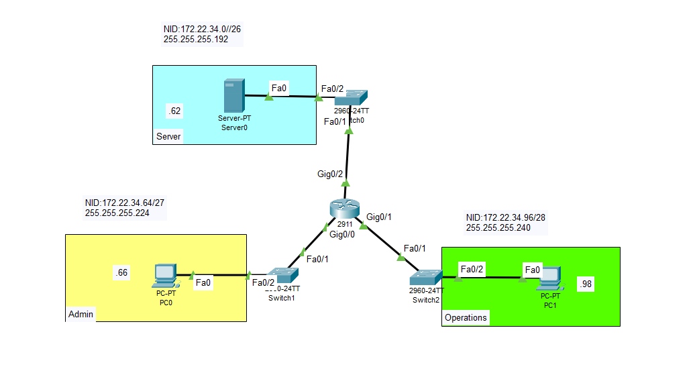

Configuring Extended Access Control Lists (ACLs)



## 📝 Project Overview
In this lab, I configured, applied, and verified both numbered and named Extended Access Control Lists (ACLs) using Cisco IOS. The primary objective was to enforce strict security policies restricting traffic types (FTP, HTTP, ICMP, and DNS) between different employee LANs and a central enterprise server.

## 🏢 Scenario & Requirements
The network consists of a central server providing services to two distinct employee machines:
* **PC1 LAN:** Requires FTP access, DNS resolution, and ICMP (Ping) access to the server.
* **PC2 LAN:** Requires HTTP (Web) access, DNS resolution, and ICMP access to the server.
* **Security Constraint:** Both employee computers must be restricted from pinging each other to ensure LAN isolation.

## 🗺️ Addressing Table

| Device | Interface | IP Address   | Subnet Mask     | Default Gateway |
|--------|-----------|--------------|-----------------|-----------------|
| **R1** | G0/0      | 172.22.34.65 | 255.255.255.224 | N/A             |
| **R1** | G0/1      | 172.22.34.97 | 255.255.255.240 | N/A             |
| **Server** | NIC       | 172.22.34.62 | 255.255.255.192 | 172.22.34.1     |
| **PC1** | NIC       | 172.22.34.66 | 255.255.255.224 | 172.22.34.65    |
| **PC2** | NIC       | 172.22.34.98 | 255.255.255.240 | 172.22.34.97    |

---

## 🛠️ Implementation Breakdown

### Part 1: Extended Numbered ACL (PC1 LAN)
I created an extended numbered ACL (`100`) applied inbound on the `G0/0` interface to explicitly permit FTP (TCP port 21), DNS (UDP/TCP port 53), and ICMP traffic from the PC1 network to the server. By relying on the router's implicit `deny any`, all other traffic was successfully blocked, including unauthorized peer-to-peer communication with PC2.

### Part 2: Extended Named ACL (PC2 LAN)
I implemented an extended named ACL (`HTTP_ONLY`) applied inbound on the `G0/1` interface. This list was engineered to allow only HTTP (TCP port 80), DNS (UDP/TCP port 53), and ICMP from the PC2 network to the server, actively preventing FTP or other anomalous traffic from crossing the router.

### Part 3: DNS Service Integration
To replicate a production environment, I enabled the DNS service on the central server and created an A Record for a designated domain. I then updated the respective access lists to permit UDP and TCP traffic on port 53, ensuring both employee PCs could successfully resolve domain names while maintaining their restricted access profiles.

---

## 💻 Key IOS Configurations

```text
! --- PC1 LAN Configuration (Numbered ACL) ---
R1(config)# access-list 100 permit tcp 172.22.34.64 0.0.0.31 host 172.22.34.62 eq ftp
R1(config)# access-list 100 permit udp host 172.22.34.66 host 172.22.34.62 eq 53
R1(config)# access-list 100 permit tcp host 172.22.34.66 host 172.22.34.62 eq 53
R1(config)# access-list 100 permit icmp 172.22.34.64 0.0.0.31 host 172.22.34.62

R1(config)# interface g0/0
R1(config-if)# ip access-group 100 in

! --- PC2 LAN Configuration (Named ACL) ---
R1(config)# ip access-list extended HTTP_ONLY
R1(config-ext-nacl)# permit tcp 172.22.34.96 0.0.0.15 host 172.22.34.62 eq www
R1(config-ext-nacl)# permit udp 172.22.34.96 0.0.0.15 host 172.22.34.62 eq 53
R1(config-ext-nacl)# permit tcp 172.22.34.96 0.0.0.15 host 172.22.34.62 eq 53
R1(config-ext-nacl)# permit icmp 172.22.34.96 0.0.0.15 host 172.22.34.62

R1(config)# interface g0/1
R1(config-if)# ip access-group HTTP_ONLY in
